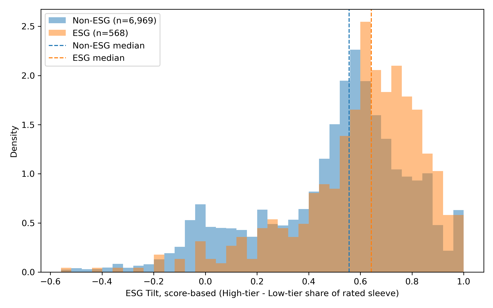
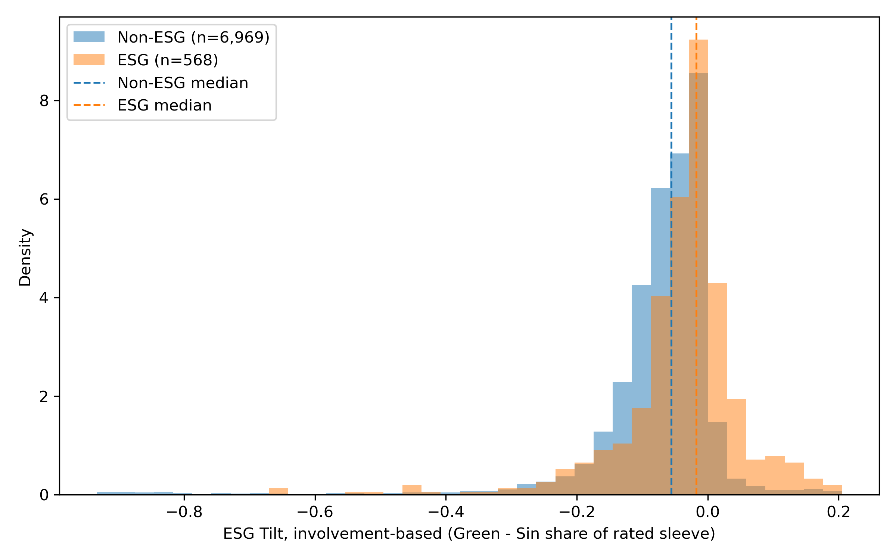
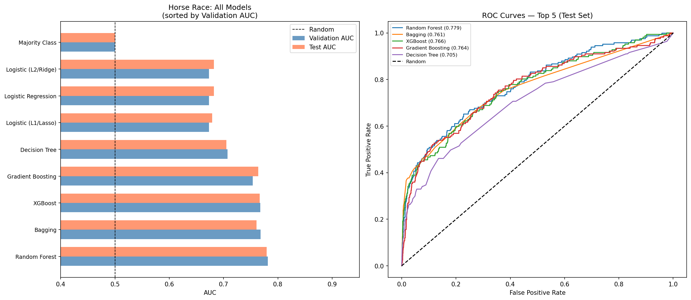

# Do ESG Funds Actually Screen? An Empirical Audit of the SEC Names Rule

A reproducible pipeline that uses SEC Form **N-PORT** holdings data and **S&P Global ESG
scores** to test whether ESG-labeled mutual funds engage in genuine security selection or
whether "ESG" functions as a light **portfolio overlay** on otherwise conventional holdings.

The analysis underlies a working paper arguing that the SEC's 2023 **Names Rule**
amendments (which extend the 80%-investment requirement to fund names suggesting an
investment "focus," including ESG terms) rest on a **category mistake** about how ESG
investing actually operates: ESG is largely a tilt expressed *across* a diversified book,
not a distinct universe of securities a fund selects *into*.

> **In one sentence:** if ESG and non-ESG funds hold largely the same issuers, differ only
> by small directional tilts, and an ESG label is the *hardest* fund-name category to
> predict from holdings, then a names rule built on a "selection" model of ESG is
> regulating the wrong thing.

---

## Results at a glance

*(Figures are produced by running the notebook; see [Reproducing the analysis](#reproducing-the-analysis) for the one-line command that regenerates and publishes them.)*

**ESG and non-ESG funds tilt the same way, only a little.**



Distribution of the *score-based tilt* (share of the rated sleeve in high-ESG-score holdings minus the share in low-score holdings), for ESG-labeled funds versus everyone else. The two distributions overlap heavily and their medians sit close together: ESG funds lean toward better-rated holdings only modestly, not categorically.



The same picture using an *involvement tilt* (green-company share minus sin-industry share). Again the two groups largely coincide — ESG-named funds are not buying from a different universe of securities; they apply a small directional tilt on top of otherwise conventional holdings.

**An "ESG" label can, to some extent, be recovered from holdings.**



How well each classifier predicts whether a fund is ESG-labeled from its portfolio alone. The holdings do carry some signal — the strongest models clear the chance line by a clear margin — but ESG is the least predictable of the fund-name categories tested (Section 7). So the label is partly recoverable, not cleanly separable, which fits a picture where ESG is a directional tilt layered on otherwise conventional holdings rather than a distinct universe a fund selects into.

> Captions describe the *shape* of the result; exact figures (overlap %, AUCs, effect sizes) live in the `outputs/*.csv` tables the notebook writes, so the repository never advertises a stale number.

---

## What this repository contains

| Path | Purpose |
|---|---|
| `notebooks/esg_names_rule_pipeline.ipynb` | End-to-end analysis: load → classify → overlap → ML horse race → benchmark-adjusted tilt (Sections 0–8). |
| `figures/` | A few curated, committed result figures (the ones shown above). |
| `data/README.md` | Data provenance, access (public vs. licensed), and exact file schemas needed to rebuild the inputs. |
| `requirements.txt` / `environment.yml` | Python dependencies (pip / conda). |
| `outputs/` | Where every table (`.csv`) and figure (`.png`) the notebook produces is written (git-ignored). |
| `LICENSE` | MIT (code only — not the data). |
| `CITATION.cff` | How to cite this code. |

---

## Method in brief

The notebook builds the empirical case in three complementary ways.

**1. Issuer-level overlap.** Holdings are collapsed to legal issuers via **LEI** (so that a
firm's many bonds count once, avoiding the duplication that inflates CUSIP/name counts), and
the analysis measures how many of the issuers held by ESG funds are *also* held by non-ESG
funds, weighted by ESG-portfolio value.

**2. Predictability "horse race."** A panel of classifiers (logistic/L1/L2, decision tree,
random forest, bagging, gradient boosting, XGBoost, against a majority-class baseline) is
trained to predict a fund's label from holdings-derived features. The same horse race is
run for *other* fund-name categories (growth, value, etc.). The question is comparative:
**is ESG distinctively hard to predict** relative to other naming conventions? A low ESG AUC
next to high AUCs elsewhere is evidence that ESG names carry little holdings-level signal.

**3. Benchmark-adjusted tilt (the richer dataset, Section 8).** Using a holdings file
enriched with **S&P Global ESG scores** and **CSA industry classifications**, each fund's
rated equity sleeve is decomposed into:

- **Green** — a *curated company list* (hand-seeded names extended by keyword-matched
  candidates from the holdings, minus an explicit false-positive list; the candidate list is
  written to `green_companies_audit.csv` for manual review and can be locked via
  `USE_AUDITED_LIST = True`);
- **Sin** — a CSA-industry regex (fossil fuel, tobacco, aerospace & defense, gaming, beverage);
- **Neutral** — a CSA-industry regex (big tech, financials, real estate, pharma, healthcare),
  reported as benchmark categories but excluded from the tilt;
- **Score tiers** — within-industry high/medium/low ESG-score shares.

Two tilt definitions are then compared between ESG and non-ESG funds:
`esg_tilt_inv` (green − sin involvement) and `esg_tilt_score` (high-tier − low-tier share).
Group differences are summarized with **Cohen's *d*, Hedges' *g*, 95% CIs**, and tested with
**Welch's *t*** and the **Mann–Whitney *U*** test, alongside binned distribution tables and
overlaid histograms.

Exact figures (overlap percentages, AUCs, effect sizes) are produced as files in `outputs/`
when the notebook is run; they are intentionally *not* hard-coded in this README so the
repository always reflects the current data and definitions rather than a stale snapshot.

---

## Reproducing the analysis

### 1. Environment

```bash
git clone https://github.com/jhchu1995/esg-fund-analysis.git
cd esg-fund-analysis

python -m venv .venv && source .venv/bin/activate     # or: conda env create -f environment.yml
pip install -r requirements.txt
```

### 2. Data

Place the input files in `./data/` (or point `ESG_DATA_DIR` elsewhere). The full list,
sources, and column schemas are in **[`data/README.md`](data/README.md)**. In short:

- **`nport_holdings_2024.csv`** — derived from **public** SEC EDGAR N-PORT filings (free to
  rebuild; the upstream scraper is a separate utility).
- **`fund_tier_shares.csv`** and **`holdings_tiered.csv`** — require **S&P Global /
  Sustainable1 ESG scores**, which are proprietary and accessed under a **WRDS** license.
  Anyone with WRDS access can rebuild them from the schemas in `data/README.md`; the scores
  themselves cannot be redistributed here.

Because of that licensing, this repository is **open in code and method but partially gated
in data** — the standard situation for empirical finance using commercial ESG ratings. The
public N-PORT half (Sections 1–6) is fully reproducible on its own.

### 3. Run

Open the notebook and run top to bottom:

```bash
jupyter lab notebooks/esg_names_rule_pipeline.ipynb
```

- Run **Section 0** once (it defines all imports, helpers, and the `DATA_DIR` / `OUTPUT_DIR`
  paths). Both directories are configurable via the `ESG_DATA_DIR` / `ESG_OUTPUT_DIR`
  environment variables and default to `./data` and `./outputs`.
- Then run **Sections 1–8** in order. Section 2 writes the ESG labels (`esg_net_scores.csv`)
  that Section 8 consumes, so Section 2 must run before Section 8.
- Every table and figure is written to `./outputs/` (git-ignored).

### 4. Publish the headline figures (optional)

`outputs/` is intentionally ignored by git. To show the figures above on the repo page,
copy the ones you want into the tracked `figures/` folder and commit them:

```bash
cp outputs/distribution_esg_tilt_score.png \
   outputs/distribution_esg_tilt_involvement.png \
   outputs/horse_race_all_models.png \
   figures/

git add figures/
git commit -m "Add headline result figures"
git push
```

The README embeds expect exactly those three filenames; swap in others (e.g.
`outputs/tilt_scatter.png`, `outputs/bins_green_total_pct.png`) and update the image paths
to match. Only commit aggregate figures — never a fund-by-fund dump of the licensed ESG
scores.

### Notebook section guide

| Section | What it does |
|---|---|
| **0** | Setup: imports, path config, and all reusable helpers (name normalization, ESG classifier, clustering, feature engineering, ML horse race). |
| **1** | Load and normalize N-PORT holdings. |
| **2** | Classify funds as ESG via sentence-embedding similarity to ESG vs. non-ESG anchor phrases, with whitelist/blacklist overrides → `esg_net_scores.csv`. |
| **3** | Issuer-level overlap between ESG and non-ESG funds (by LEI). |
| **5** | Build the fund-level feature matrix for ML. |
| **6** | Horse race: predict the ESG label from holdings features. |
| **7** | Baseline AUCs: the same horse race for other fund-name categories — is ESG distinctively unpredictable? |
| **8** | Benchmark-adjusted tilt and green/sin/neutral analysis on the richer ESG-scored dataset (Cohen's *d* / Hedges' *g* / Welch / Mann–Whitney; tilt distributions; "who passes the green test"). |

---

## Notes & caveats

- **Classifier nondeterminism.** Section 2 downloads a sentence-transformer model on first
  run; the embedding step needs network access once and a little patience.
- **Green list is auditable, not automatic.** The curated green list is deliberately
  reviewable: run Section 8.2 once to generate `green_companies_audit.csv`, edit it, then set
  `USE_AUDITED_LIST = True` and rerun to lock your reviewed version.
- **Scope of claims.** Tilts and overlap are measured on the *rated equity sleeve* (positions
  with a non-missing ESG score and positive weight); the notebook also reports whole-NAV
  versions where relevant.

## Citation

If you use this code, please cite it via [`CITATION.cff`](CITATION.cff).

## License

Code is released under the [MIT License](LICENSE). The license covers the code only; the
underlying SEC and S&P Global data are governed by their own terms (see `data/README.md`).

## Author

**Jui-Hsiang (Alex) Chu** — JSD candidate. Empirical legal studies at the intersection of
financial regulation and data science.
